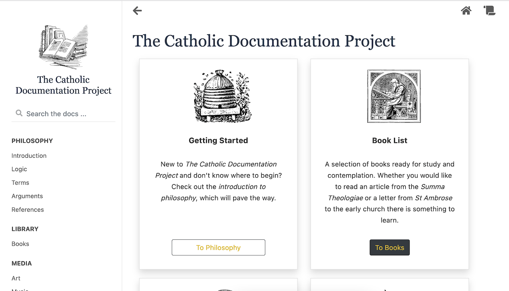

# The Catholic Documentation Project

## About
This is an effort to document all of the materials in the Catholic Tradition that have informed my worldview.
I am a humble software developer by day who has gotten really into scholastic metaphysics by night.

## Built With
* The Sphinx Document Generator
* The sphinx book theme
* readthedocs

## Getting Started
If you my fellow coder would like to take a break and read some very interesting claims about the world go ahead and check out the 
build here
<https://tcdp.readthedocs.io/en/latest/>

If you are not interested in that there should still be some value in checking out the project to see how to
use the sphinx document generator with read the docs.

## License

## Acknowledgements
All of the folks at the readthedocs project for creating such a great service
